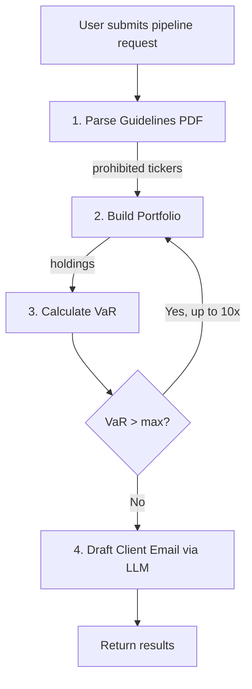
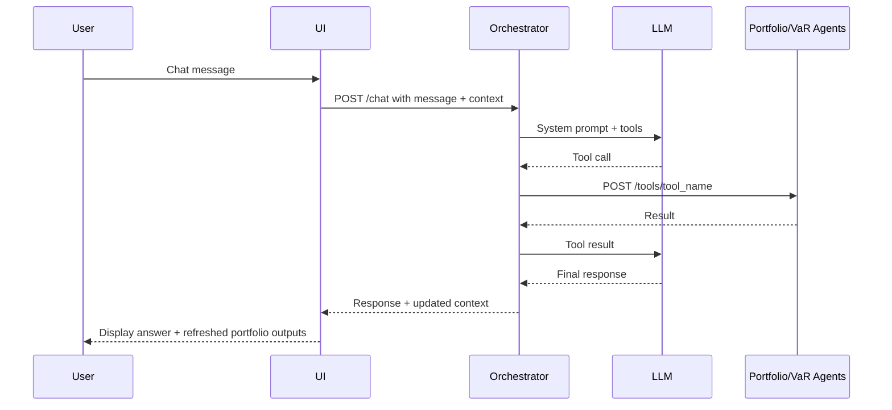

# Build compliant investment portfolios with AI-powered risk management

An AI-powered investment advisor that combines a language model with specialized financial tool agents to automate portfolio construction, compliance checking, and risk analysis. The system parses client investment guidelines, builds compliant portfolios, calculates Value at Risk, and generates client-ready communications — then lets you iterate through agentic chat.

## Table of contents

1. [Detailed description](#detailed-description)
   - [The Challenge](#the-challenge)
   - [Our Solution](#our-solution)
   - [Our Solution Stack](#our-solution-stack)
   - [Architecture diagrams](#architecture-diagrams)
2. [Requirements](#requirements)
   - [Minimum hardware requirements](#minimum-hardware-requirements)
   - [Minimum software requirements](#minimum-software-requirements)
   - [Required user permissions](#required-user-permissions)
3. [Deploy](#deploy)
   - [Quick Start - OpenShift Deployment](#quick-start---openshift-deployment)
   - [Quick Start - Local Development](#quick-start---local-development)
   - [Usage](#usage)
   - [Delete](#delete)
4. [References](#references)
5. [Tags](#tags)

## Detailed description

### The Challenge

Portfolio managers at asset management firms must build investment portfolios that satisfy each client's unique guidelines, meet risk tolerances, avoid prohibited securities, and hit return targets. Now multiply that across tens or hundreds of clients. The manual process — reading guideline documents, cross-referencing prohibited tickers, running risk calculations, and drafting client communications — is slow, error-prone, and does not scale.

### Our Solution

An AI multi-agent system that automates the end-to-end portfolio construction workflow in two phases:

**Phase 1 — Deterministic Pipeline:**
- Parses client investment guideline PDFs and extracts prohibited ticker symbols using an MLP classifier
- Builds a compliant equal-weight equity portfolio from the S&P 100, excluding prohibited securities
- Calculates 1-day parametric Value at Risk (VaR) at 99% confidence
- Automatically retries portfolio construction if VaR exceeds the client's risk threshold (up to 10 attempts)
- Drafts a client-ready summary email via the LLM

**Phase 2 — Agentic Chat:**
- Interactive chat where the LLM can call portfolio and VaR tools to modify holdings and recalculate risk
- Prohibited tickers from Phase 1 persist — the advisor cannot violate compliance constraints
- VaR is automatically recalculated after every portfolio change

### Our Solution Stack

#### AI/ML
* LLM — powers email drafting, agentic chat reasoning, and tool selection (served via RHOAI model serving or any OpenAI-compatible endpoint). Tested with [Llama 3.3 70B quantized](https://huggingface.co/RedHatAI/Llama-3.3-70B-Instruct-quantized.w8a8).
* scikit-learn MLP — classifies guideline sentences as prohibition-related to extract banned tickers.

#### Backend Services
* Flask — REST API orchestrator + 3 specialized tool agents.
* OpenAI Python SDK — LLM function calling for agentic chat.
* yfinance — real-time market data for portfolio pricing and VaR calculation.

#### Frontend
* React + Vite + TypeScript — two-tab UI for pipeline execution and portfolio chat.

#### Infrastructure
* Podman/Docker Compose — local development.
* Red Hat OpenShift + Helm — production deployment.
* Optional: Knative — serverless agent auto-scaling.

### Architecture diagrams

#### Phase 1: Deterministic Pipeline

The UI calls granular orchestrator endpoints in sequence, reimplementing the retry loop client-side for real-time progress feedback.



#### Phase 2: Agentic Chat

The LLM selects from `portfolio_equities`, `portfolio_replace_symbol`, and `value_at_risk` tools. Guidelines are frozen — prohibited tickers cannot be overridden. VaR is recalculated automatically after every portfolio mutation.



## Requirements

NOTE: This quickstart assumes a large language model is already deployed in your environment. Guidance for deploying models is available in the [References](#references) section.

### Minimum hardware requirements

CPU: 2+ cores
Memory: 4Gi
Storage: 10Gi
- **Optional:** GPU — required only if you plan to deploy your own model on OpenShift AI, for deployment refer to [References](#references).

### Minimum software requirements

#### OpenShift Cluster Deployment
- **Red Hat OpenShift AI** 2.25.0 or later (for model serving)
- **Helm** 3.0.0 or later
- **oc CLI** (for OpenShift)
- **LLM Model Server** — Red Hat OpenShift AI model serving (vLLM) recommended, or any OpenAI-compatible endpoint.

#### Local Development Requirements
- Podman and Podman Compose (or Docker and Docker Compose)
- Make (for running deployment commands)

### Required user permissions

#### Local Development

- Permission to run containers via Podman or Docker
- Access to local ports: `5000`, `7001`, `7002`, `7003`, `8080`

#### OpenShift Cluster Deployment

- Authenticated to the OpenShift cluster (`oc login`)
- Permission to create or access a namespace/project

## Deploy

### Quick Start - OpenShift Deployment

For production deployment on OpenShift clusters:

```bash
make deploy-cluster
# or: helm upgrade --install investment-advisor-agent deploy/helm -n investment-advisor-agent --create-namespace
```

To deploy with serverless (Knative) agents:

```bash
helm upgrade --install investment-advisor-agent deploy/helm \
  -n investment-advisor-agent --create-namespace \
  --set serverless.enabled=true
```

### Quick Start - Local Development

#### 1. Clone and Setup Repository

```bash
git clone https://github.com/rh-ai-quickstart/investment-advisor-agent.git
cd investment-advisor-agent
```

#### 2. Configure Environment Variables

```bash
cp .env.example .env
```

Edit `.env` with your LLM configuration:
```bash
OPENAI_API_ENDPOINT=https://your-llm-host/v1   # OpenAI-compatible endpoint (include /v1)
OPENAI_API_TOKEN=sk-your-api-key                # API key for the endpoint
OPENAI_MODEL=llama-3-3-70b-instruct-w8a8        # Model name
```

> **Tip:** For enterprise deployments, we recommend using [Red Hat OpenShift AI model serving](https://docs.redhat.com/en/documentation/red_hat_openshift_ai_self-managed/3.0/html/deploying_models/deploying_models) to host your LLM with built-in GPU support, autoscaling, and enterprise security.

#### 3. Start All Services

```bash
make deploy-local
# equivalent to: podman compose -f deploy/local/compose.yml up -d --build
```

| Service | URL |
| --- | --- |
| UI | http://localhost:8080 |
| Orchestrator API | http://localhost:5000 |

### Usage

Open the UI at **http://localhost:8080** (or the OpenShift route).

If you created a `.env` file, the LLM endpoint, API key, and model are loaded automatically. Otherwise, expand **Connection settings** to enter them manually.

**Tab 1 — Portfolio Setup:**

1. Set the **Investment guidelines URL**, **Portfolio value**, **Number of symbols**, and **Max VaR**.
2. Click **Run pipeline**. A live progress log shows each step: guidelines parsing, portfolio construction (with VaR retry loop), and email drafting.
3. On success, results appear in **Portfolio outputs** and the chat tab unlocks.

**Tab 2 — Discuss Portfolio:**

- Chat about the portfolio — the LLM can call tools to swap holdings, rebuild the portfolio, or recalculate VaR.
- Portfolio outputs refresh automatically when the context changes.

### Delete

#### Stop Local Deployment

```bash
podman compose -f deploy/local/compose.yml down
```

#### Delete from OpenShift

```bash
helm uninstall investment-advisor-agent -n investment-advisor-agent
```

## References

- [How to deploy language models with Red Hat OpenShift AI](https://developers.redhat.com/articles/2025/09/10/how-deploy-language-models-red-hat-openshift-ai)

## Tags

* Industry: Financial Services
* Product: Red Hat OpenShift AI
* Contributor org: Red Hat
